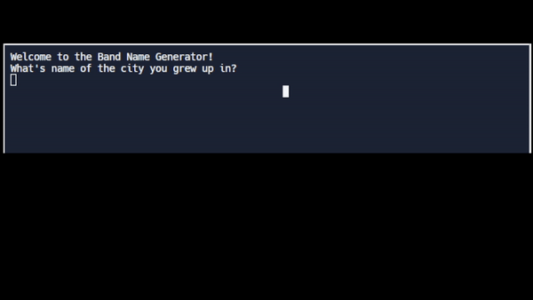

# Day 1 - Working with Variables in Python to Manage Data

## Topic:
``` Printing, Commenting, Debugging, String Manipluation, and Variables```

---

### Printing: 
The function ```print()``` allow the display a message to the console.
```
Ex. 
print("Hello World!")

Output: Hello World!
```

---

### Commenting:
To comment a line in python editor. You will be using the ```#``` known as the hashtag. 
> **_NOTE:_** Python will ignore comments. 

> To comment use > ```Control + \ ```in Window and ```cmd  + /``` in Mac

Ex.
```
#This is a comment line. Single line comment
print("Hello World!")

Output: Hello World!


#This 
#is 
#multiline comments
print("Hello World!")

Output: Hello World!


"""
This is known as triple double quotes. It comments everything
inside here.
"""
print("Hello World!")

Output: Hello World!

```

---

### Debugging:
Debug is a simple yet hard concept to find the root causes of a problem in the code. The best practice is to use the function to print() to debug your code or use Stack OverFlow the errors. It's okay to use google to answer your questions.

---

### String Manipluation: 
String manipluation is a way to change or alter the current string into a specific new value/string.
```

Ex.
This convert the string of "new york" into all capitalized "NEW YORK"

upperCase = "new york".upper()
print(upperCase)

Output: NEW YORK

#Concat/Combining Strings
print("Hello" + " Jason")

is equal to print("Hello" + " "+"Jason")
>Spacing and identation is important!

Output: Hello Jason

```
If you wanted to read more string manipluation: 
> [FreeCodeCamp String Manipluation](https://www.freecodecamp.org/news/python-string-manipulation-handbook/)

> [w3schools String Methods](https://www.w3schools.com/python/python_ref_string.asp)

---

### Variables:
A variable is a name that reference to an object. A variable is responsible for data values.

```
Ex. 

name = "Jason"
year = 2023
isFriday = False

In the above, "name", "year", and "isFriday" are all variables.

"name" is a string variable.
"year" is a integer variable.
"isFriday" is a boolean variable.
```


### Input Function:
```
>input() is a function give the user/window/console a prompt. Make sure to add a quote for the prompt to work.

Ex.
input("What is the current year?: ")

Output: What is the current year?: 2023


To greet the person with a prompt and combine with print() function.
Ex.

print("Good morning, " + input("What is your name?: ") + ".")

Output: What is your name?: Jason
Output: Good morning, Jason.


We can also store the user's prompt into a variable.
Ex.
color = input("What is your favorite color?: ")
print("Your favorite color is " + color)

Output: What is your favorite color?: Blue
Output: Your favorite color is blue
```


---

### Exercise:
1. [https://replit.com/@HuiHongOP/day-1-printing-start#main.py](https://replit.com/@HuiHongOP/day-1-printing-start#main.py)
2. [https://replit.com/@HuiHongOP/day-1-2-exercise#main.py](https://replit.com/@HuiHongOP/day-1-2-exercise#main.py)
3. [https://replit.com/@HuiHongOP/day-1-3-exercise#main.py](https://replit.com/@HuiHongOP/day-1-3-exercise#main.py)
4. [https://replit.com/@HuiHongOP/day-1-variables-start#main.py](https://replit.com/@HuiHongOP/day-1-variables-start#main.py)
5. [https://replit.com/@HuiHongOP/day-1-4-exercise#main.py](https://replit.com/@HuiHongOP/day-1-4-exercise#main.py)

### Project: Band Name Generator
[https://replit.com/@HuiHongOP/band-name-generator-start#main.py](https://replit.com/@HuiHongOP/band-name-generator-start#main.py)




