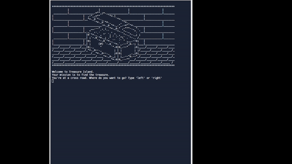

# Day 3: Control Flow and Logical Operators

## Topic: Conditional Statements, Logical Operators, Code Blocks and Scope

### Lesson:

> The uses of logical operators such as `and`, `or`, `not`.

> I Learned the difference between `if`, `elif` and `else`.

> There are many functions that we can use such as `count()` to count the number of occurences in a string variable and `lower()` to lower all the string variable.

### Exercise
1. `If`, `else` and `Conditional Operators` [https://replit.com/@HuiHongOP/day-3-start#main.py](https://replit.com/@HuiHongOP/day-3-start#main.py)
   
2. Odd and even [https://replit.com/@HuiHongOP/day-3-1-exercise#main.py](https://replit.com/@HuiHongOP/day-3-1-exercise#main.py)
   
3. BMI calculator [https://replit.com/@HuiHongOP/day-3-2-exercise#main.py](https://replit.com/@HuiHongOP/day-3-2-exercise#main.py)
   
4. Lear Year [https://replit.com/@HuiHongOP/day-3-3-exercise#main.py](https://replit.com/@HuiHongOP/day-3-3-exercise#main.py)
   
5. Pizza order Practice [https://replit.com/@HuiHongOP/day-3-4-exercise#main.py](https://replit.com/@HuiHongOP/day-3-4-exercise#main.py)
   
6. Love Calcaltor [https://replit.com/@HuiHongOP/day-3-5-Love-Calculator#main.py](https://replit.com/@HuiHongOP/day-3-5-Love-Calculator#main.py)

### Project: Treasure Island
[https://replit.com/@HuiHongOP/treasure-island-start-1](https://replit.com/@HuiHongOP/treasure-island-start-1)

