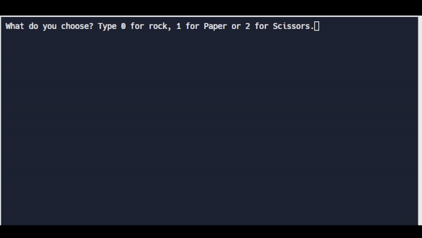

# Day 4: Randomisation and Python Lists

## Topic: Random(), List, Append() and Nested Lists. 

### Exercise
1. Random Numbers  [https://replit.com/@HuiHongOP/day-4-start#main.py](https://replit.com/@HuiHongOP/day-4-start#main.py)
2. Head and Tail [https://replit.com/@HuiHongOP/day-4-1-solution#main.py](https://replit.com/@HuiHongOP/day-4-1-solution#main.py)
3. Banker Roulette [https://replit.com/@HuiHongOP/day-4-2#main.**py**](https://replit.com/@HuiHongOP/day-4-2#main.py)
4. Treasure Map [https://replit.com/@HuiHongOP/day-4-3-solution#main.py](https://replit.com/@HuiHongOP/day-4-3-solution#main.py)

### Project: Rock Paper Scissors

Rock Paper and Scissors [https://replit.com/@HuiHongOP/rock-paper-scissors-start](https://replit.com/@HuiHongOP/rock-paper-scissors-start)

