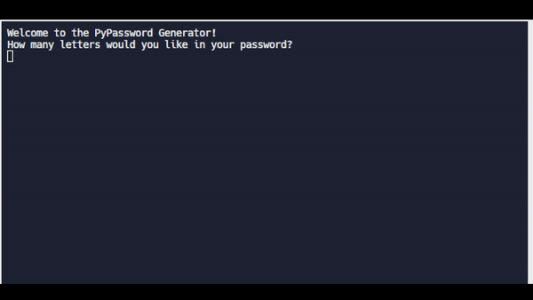

# Day 5: Python Loops

### Lessons
> Loop are vital for repeating things.

> sum(), len(), min(), max(), and range() functions

> random.shuffle() randomize a list 

> random.sample(string,len(string)) shuffle string

### Exercise:
1. The Average Height [https://replit.com/@HuiHongOP/day-5-1](https://replit.com/@HuiHongOP/day-5-1)
2. The Highest Score [https://replit.com/@HuiHongOP/day-5-2#main.py](https://replit.com/@HuiHongOP/day-5-2#main.py)
3. Sum of even numbers [https://replit.com/@HuiHongOP/day-5-3#main.py](https://replit.com/@HuiHongOP/day-5-3#main.py)
4. FizzBuzz [https://replit.com/@HuiHongOP/day-5-4#main.py](https://replit.com/@HuiHongOP/day-5-4#main.py)

### Project: Password Generator
[https://replit.com/@HuiHongOP/password-generator-start#main.py](https://replit.com/@HuiHongOP/password-generator-start#main.py)

