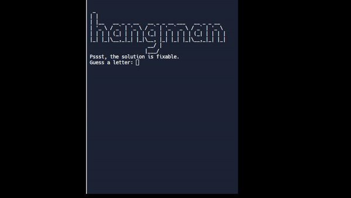

# Day 7: Beginner - Hangman

### Lesson:

> Importing modules from other files using ``` from filesname import function/class```

> The usable of while loop and ```Not``` statements.


### Exercise:
1. Challenge 1 [https://replit.com/@HuiHongOP/Day-7-Hangman-1-Start#main.py](https://replit.com/@HuiHongOP/Day-7-Hangman-1-Start#main.py)
2. Challenge 2 [https://replit.com/@HuiHongOP/Day-7-Hangman-2-Start](https://replit.com/@HuiHongOP/Day-7-Hangman-2-Start)
3. Challenge 3 [https://replit.com/@HuiHongOP/Day-7-Hangman-3-Start#main.py](https://replit.com/@HuiHongOP/Day-7-Hangman-3-Start#main.py)
4. Challenge 4 [https://replit.com/@HuiHongOP/Day-7-Hangman-4-Start#main.py](https://replit.com/@HuiHongOP/Day-7-Hangman-4-Start#main.py)
5. Challange 5 and Final [https://replit.com/@HuiHongOP/Day-7-Hangman-5-Start#main.py](https://replit.com/@HuiHongOP/Day-7-Hangman-5-Start#main.py)

