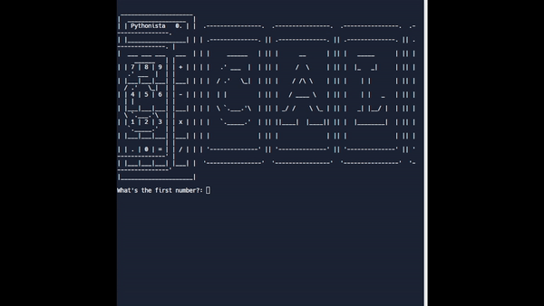

# Day 10: Beginner - Functions with Outputs

## Topics: Dictionaries, Functions, Recursion and return

### Lesson:

> return helps to output the result from a function

> functions can be used as a lookup in dictionary

> docstrings are using triple quotations

### Exercise
1. Days in month [https://replit.com/@HuiHongOP/day-10-1-solution#main.py](https://replit.com/@HuiHongOP/day-10-1-solution#main.py)
2. Final Calculator [https://replit.com/@HuiHongOP/calculator-start#main.py](https://replit.com/@HuiHongOP/calculator-start#main.py)

