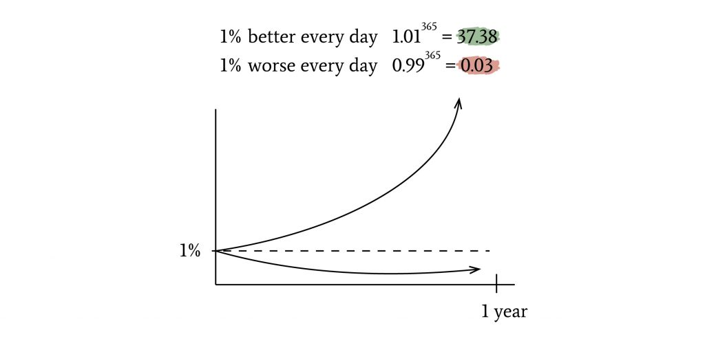

## 🗒️ About
```
Hello, my name is Hui Hong(Jason). I have started my journey on 100 days of Python.  This course consists of 100 projects from beginner to professional. I highly recommened to anyone who wanted to learn to become a python programmer.
```

I will try to post all the exercises and activities that I would be doing in the course. However, some of the exercises wouldn't be posted here due to the assignments/exercises are in a classroom environment. Therefore, it would be best of your interest to buy the course and get access to all of the exercises and resources.

Each day will contain a readme.md that will explain the topic with examples and resources.


## 🔗 Udemy Link
```Here is the link to the course``` [100 Days of Code: The Complete Python Pro Bootcamp for 2023](https://www.udemy.com/course/100-days-of-code/)


## 🦾 Motivation
``` 
> 1% improvement everyday is 37x better in one year inspired by the author of "Atomic Habits" 
```


``` 
> It takes 21-31 days to routinize a habit 
```

# 📚 Lesson Content

## 🐣 Beginners
* Day 1 - Working with Variables in Python to Manage Data
* Day 2 - Understanding Data Types and How to Manipulate Strings
* Day 3 - Control Flow and Logical Operators
* Day 4 - Randomisation and Python Lists
* Day 5 - Python Loops
* Day 6 - Python Functions and Karel
* Day 7 - Hangman Game
* Day 8 - Function Parameters and Caesar Cipher
* Day 9 - Dictionaries, Nesting and the Secret Auction
* Day 10 - Functions with Outputs
* Day 11 - The Blackjack Capstone Project
* Day 12 - Scope and Number Guessing Game
* Day 13 - How to Find and Fix Errors in your Code
* Day 14 - Higher Lower Game Project
* Day 15 - Local Development Evironment Setup and the Coffee Machine Game

## 🐤 Intermediate 
* Day 16 - Object Orinted Programming
* Day 17 - The Quiz Project and Benefits of OOP
* Day 18 - Turtle and The Graphical User Interface (GUI)
* Day 19 - Instances, State and Higher Order Functions
* Day 20 - Build the Snake Game Part 1: Animation and Coordinates
* Day 21 - Build the Snake Game Part 2: Inheritance and List Slicing
* Day 22 - Build Pong: The Famous Arcade Game
* Day 23 - The Turtle Crossing Capstone Project
* Day 24 - Files, Directories, and Paths
* Day 25 - Working with CSV Data and the Pandas Library
* Day 26 - List Comprehension and the NATO Alphabet
* Day 27 - Tkinter, *args, **kwargs and Creating GUI Programs
* Day 28 - Tkinter, Dynamic Typing and the Pomodoro GUI Application
* Day 29 - Building a password Manager GUI App with Tkinter
* Day 30 - Errors, Exceptions and JSON Data: Improving the Password
* Day 31 - Flash Card App Capstone Project
* Day 32 - Send Email (smtplib) and Manage Dates(datetime)
* Day 33 - API Endpoints and API Parameters - ISS Overhead Notifier
* Day 34 - API Practice - Creating a GUI Quiz App
* Day 35 - Keys, Authentication and Environment Variables: Send SMS
* Day 36 - Stock Trading News Alert Project
* Day 37 - Habit Tracking Project: API POST Requests and Headers
* Day 38 - Workout Tracking Using Google Sheets
* Day 39 - Capstone Part 1: Flight Deal Finder
* Day 40 - Capstone Part 2: Flight Club
* Day 41 - Introduction to HTML
* Day 42 - Intermediate HTML
* Day 43 - Introduction to CSS
* Day 44 - Intermediate CSS
* Day 45 - Web Scraping with Beautiful Soup
* Day 46 - Create a Spotify Playlist using the Musical Time Machine
* Day 47 - Create an Automated Aamazon Price Tracker
* Day 48 - Selenium Webdriver Browser and Game Playing Bot
* Day 49 - Automating Job Applications on LinkedIn
* Day 50 - Auto Tinder Swiping Bot
* Day 51 - Internet Speed Twitter Complaint Bot
* Day 52 - Instagram Follower Bot
* Day 53 - Web Scraping Capstone - Data Entry Job Automation
* Day 54 - Introduction to Web Development with Flask
* Day 55 - Intermedidate HTML and URL Parising in Flask and Higher Lower Game
* Day 56 - Rendering HTML/Static files and Using Website Templates
* Day 57 - Templating with Jinja in Flash Applications
* Day 58 - Web Foundation Bootstrap

## 🐔 Advanced
* Day 59 - Blog Capstone Project Part 2 - Adding Styling
* Day 60 - Make POST Requests with Flask and HTML Forms
* Day 61 - Building Advanced Forms with Flask-WTForms
* Day 62 - Flash, WTForms, Bootstrap and CSV - Coffee and Wifi Project
* Day 63 - Databases and with SQLite and SQLAlchemy 
* Day 64 - My Top 10 Movies Website
* Day 65 - Web Design School - How to Create a Website that People will Love
* Day 66 - Building Your Own API with RRESTful Routing
* Day 67 - Blog Capstone Project Part 3 - RESTful Routing
* Day 68 - Authentication with Flask
* Day 69 - Blog Capstone Project Part 4 - Adding Users
* Day 70 - Delopying Your Web Application with Heroku
* Day 71 - Data Exploration with Pandas: College Major v.s. Your Salary
* Day 72 - Data Visualization with Matplotlib: Programming Languages
* Day 73 - Aggregate and Merge Data with Pandas: Analyse the LEGO Dataset
* Day 74 - Google Trends Data Resampling and Visuaalizing Time Series
* Day 75 - Beautiful Plotly Charts and Analyzing the Android App Store
* Day 76 - Computatopn with NumPy and N-Dimension Arrays
* Day 77 - Linear Regression and Data Visualization with Seaborn
* Day 78 - Analyzing the Nobel Prize with Plotly, Matplotlib and Seaborn
* Day 79 - The Tragic Discovery of Handwashing: t-Tests and Distributions 
* Day 80 - Capstone Project - Predict House Prices

## 🎉 Professional
* Day 81 - Professional Portfolio Project - [Python Scripting]
* Day 82 - Professional Portfolio Project - [Python Web Development]
* Day 83 - Professional Portfolio Project - [Python Scripting]
* Day 84 - Professional Portfolio Project - [GUI]
* Day 85 - Professional Portfolio Project - [GUI]
* Day 86 - Professional Portfolio Project - [Game]
* Day 87 - Professional Portfolio Project - [Web Development]
* Day 88 - Professional Portfolio Project - [Web Development]
* Day 89 - Professional Portfolio Project - [GUI Desktop APP]
* Day 90 - Professional Portfolio Project - [HTTP Requests and APIs]
* Day 91 - Professional Portfolio Project - [Image Processing and Data Science]
* Day 92 - Professional Portfolio Project - [Web Scraping]
* Day 93 - Professional Portfolio Project - [GUI Automation]
* Day 94 - Professional Portfolio Project - [Game]
* Day 95 - Professional Portfolio Project - [HTTP Requests and APIs]
* Day 96 - Professional Portfolio Project - [Web Development]
* Day 97 - Professional Portfolio Project - [Python Automation]
* Day 98 - Professional Portfolio Project - [Data Science]
* Day 99 - Professional Portfolio Project - [Data Science]
* Day 100 - Professional Portfolio Project - [Data Science]
* Section 101: Final Stretch

---
## 📱 Social Media
```If you network and connect me. Feel free to ask any questions as well. :) ``` [Linkedin Link](https://www.linkedin.com/in/huihong-op/)
